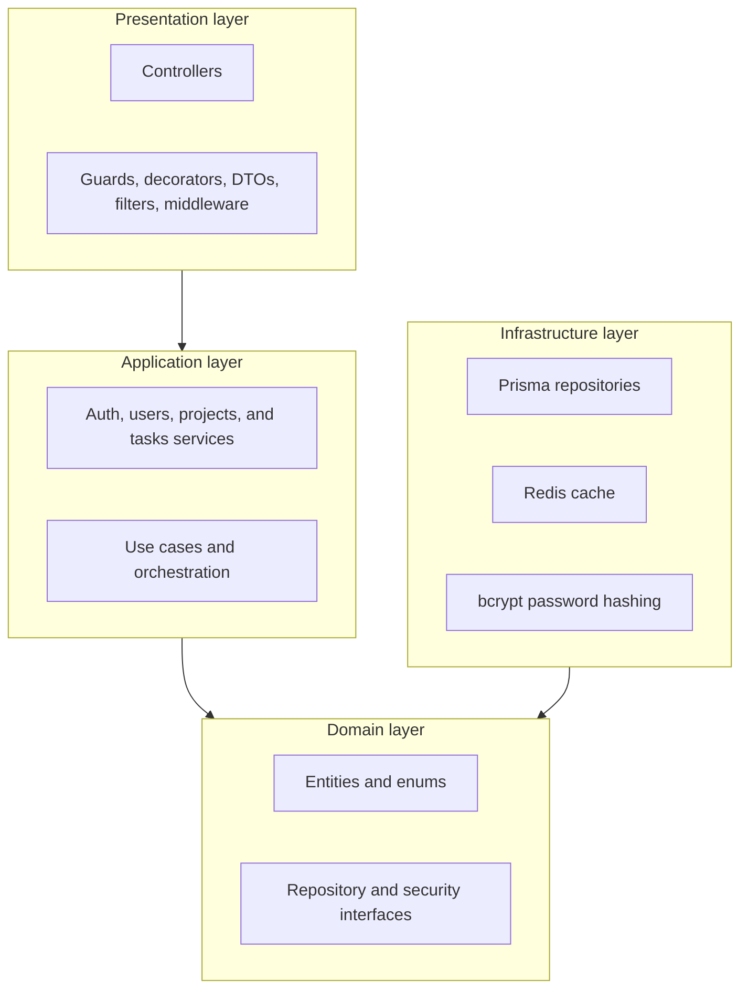
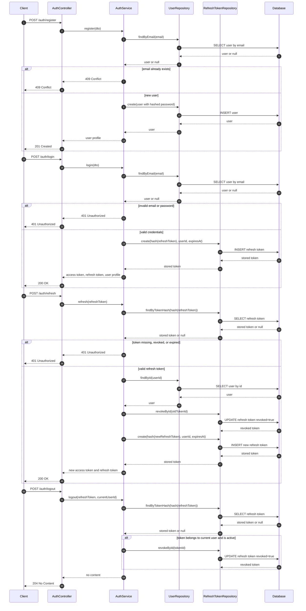
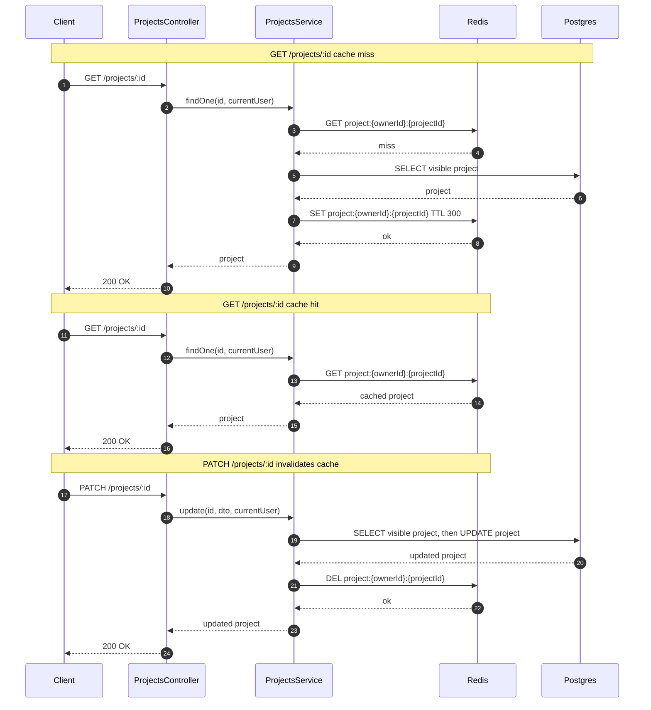
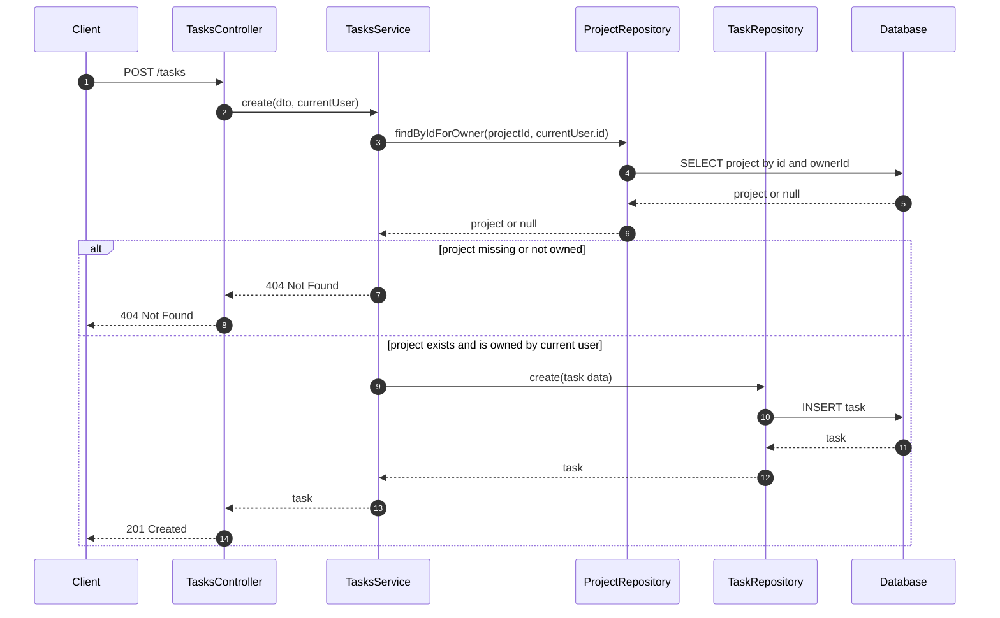

# Architecture and Flow Diagrams

This page collects the main dependency and request flows for the API. The diagrams use Mermaid syntax so they render directly on GitHub.

## Layered Architecture

The source is split into presentation, application, domain, and infrastructure layers. Dependency arrows point toward the code each layer depends on: controllers call application services, services work with domain entities and repository contracts, and infrastructure implements those contracts behind Prisma, Redis, and bcrypt. The domain layer sits at the center and has no outgoing dependencies on NestJS, HTTP, Prisma, Redis, or any other outer layer.

## Authentication Flow

Auth requests enter through `AuthController` and are handled by `AuthService`. User and refresh-token persistence stays behind repository contracts, with refresh tokens stored as hashes and rotated on refresh so the used token is revoked before a new pair is issued.

## Project Detail Cache Flow

Project detail reads are cached after `GET /projects/:id` using the `project:{ownerId}:{projectId}` key and a 300 second TTL. Redis is best-effort: on a miss, the service falls back to Postgres and fills the cache; on a hit, it returns the cached project response. Updates invalidate the matching key so the next read repopulates Redis with fresh data.

## Task Creation Ownership Flow

Task creation checks project ownership before creating the task. Regular users must create tasks only inside projects they own, and missing or unauthorized projects return `404 Not Found` so the API does not leak whether another user's project exists.

